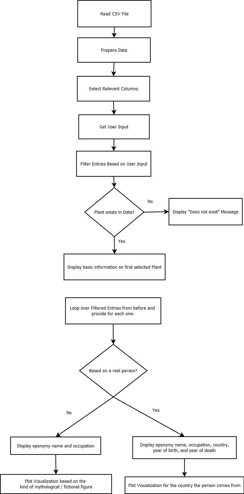

# DS_Homework

This is an easy programming-example for the Data-Steward Certificate Course. By providing a plant genus name as input, users of our program can research whether the plant was named after a famous woman.

For this, we take a csv file that holds plant genera that were named after famous women (often scientists themselves). 

<!--dieser Teil muss noch Forumiert werden-->
- User Input wird im File gesucht (ist Pflanzenname vorhanden)
- Wenn ja: Ausgabe wichtiger Informationen über die Pflanze und ihre Namensgeberin; Zusätzlich Diagramm zu Orten oder Arten von Personen (je nach Mythologisch oder nicht?)
- Wenn nein: Info, dass Pflanze nicht gefunden wurde

Data file in Zenodo:
https://zenodo.org/records/10038070
Publikation:
Mering S, Gardiner LM, Knapp S, Lindon H, Leachman S, Ulloa Ulloa C, Vincent S, Vorontsova MS (2023) Creating a multi-linked dynamic dataset: a case study of plant genera named for women. Biodiversity Data Journal 11: e114408. https://doi.org/10.3897/BDJ.11.e114408

